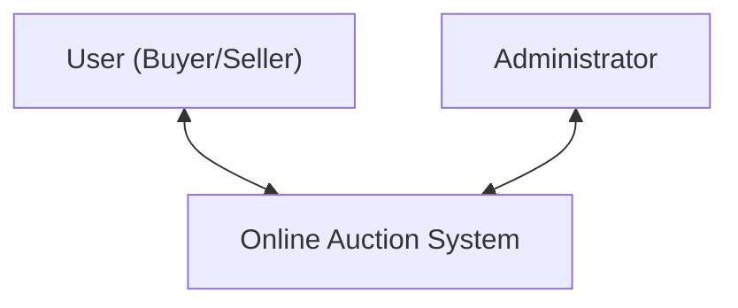
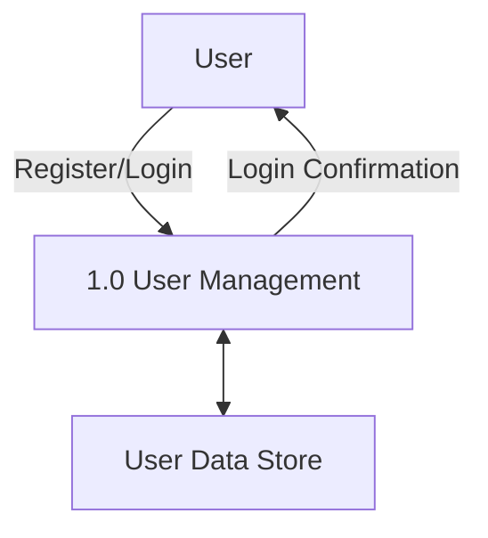
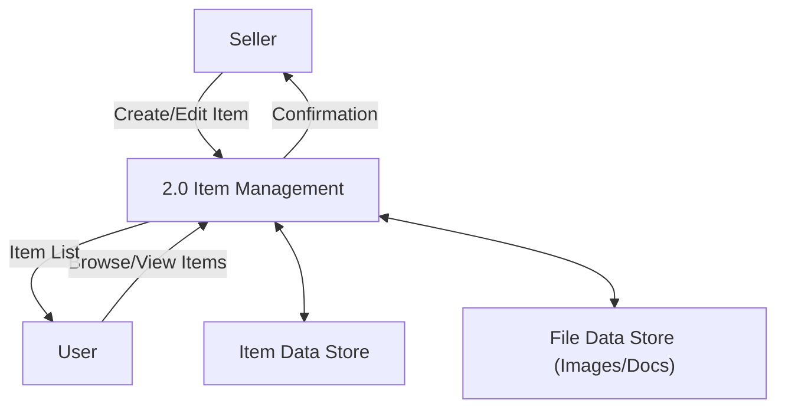
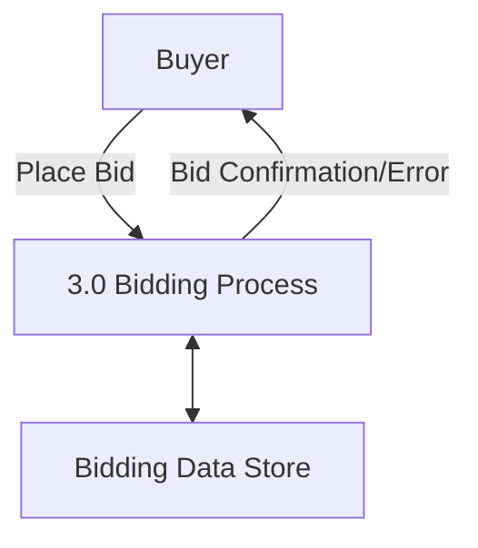
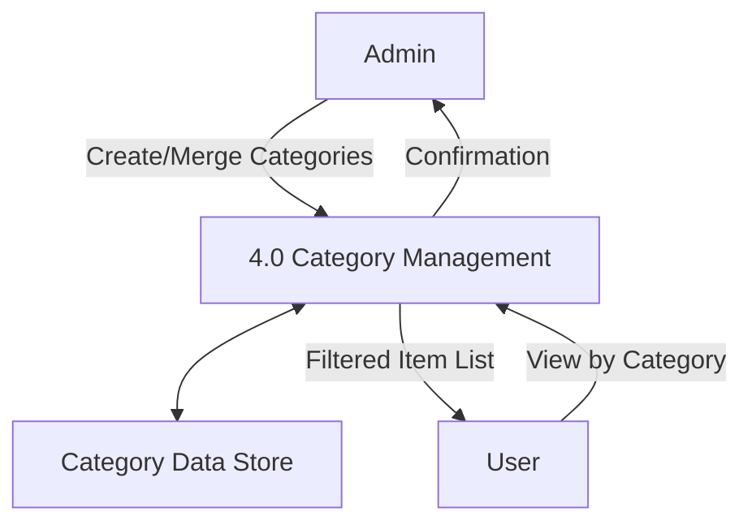
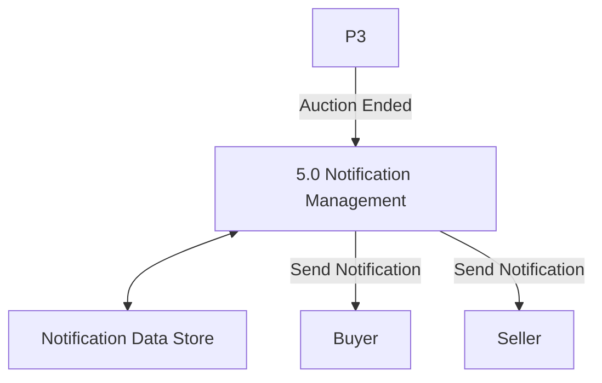
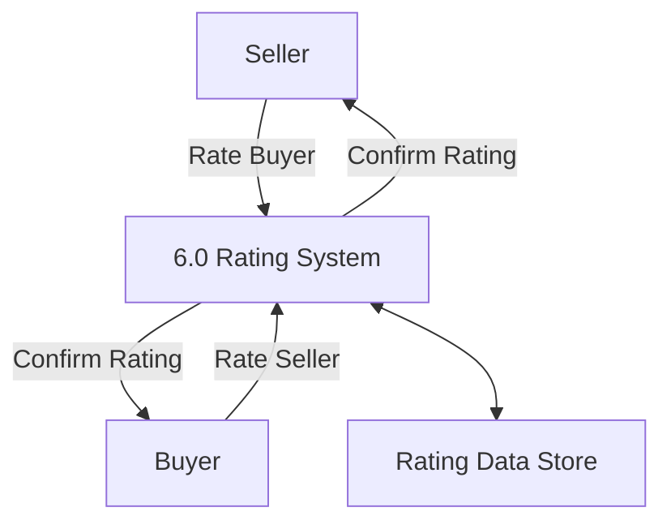
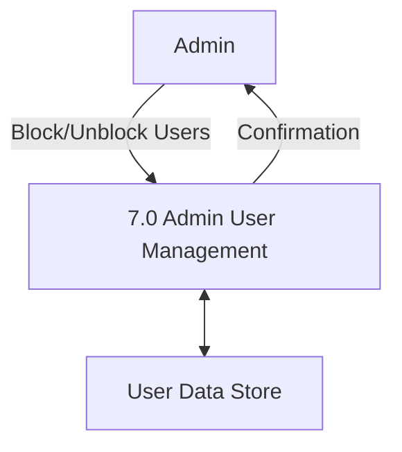

# Data Flow Diagram (DFD)

## Context Diagram (DFD Level 0)

## Level 1 DFD

Each item below represents a main process in DFD Level 1. More detailed sub-processes and their specific interactions with Data Stores will be described in DFD Level 2.

### 1. User Management (Process 1.0)

This process handles all user-related actions including registration, login, authentication, and profile updates. It interacts with the user data store to manage account information.

### 2. Item Management (Process 2.0)

This process allows sellers to add, edit, or delete products for auction. It also enables users to browse and view detailed product information. It interacts with the item data store and file data store to handle product data and media uploads.

### 3. Bidding Process (Process 3.0)

This process manages all bidding operations. Users can place bids, and the system checks the validity, updates the current bid status, and stores data in the bidding store.

### 4. Category Management (Process 4.0)

This process is used by the administrator to manage product categories. Users can browse products through categories. The category data store maintains all category information.

### 5. Notification Management (Process 5.0)
This process automatically sends notifications to users (buyer and seller) when an auction ends. It interacts with the notification data store to read and write messages.

### 6. Rating System (Process 6.0)
This optional process allows buyers and sellers to rate each other after a transaction. The rating is recorded in the rating data store and can be used to evaluate trustworthiness.

### 7. Admin User Control (Process 7.0)

This process allows the admin to manage user accounts, including blocking or unblocking fraudulent users. It uses the user data store for reading and updating account statuses.

