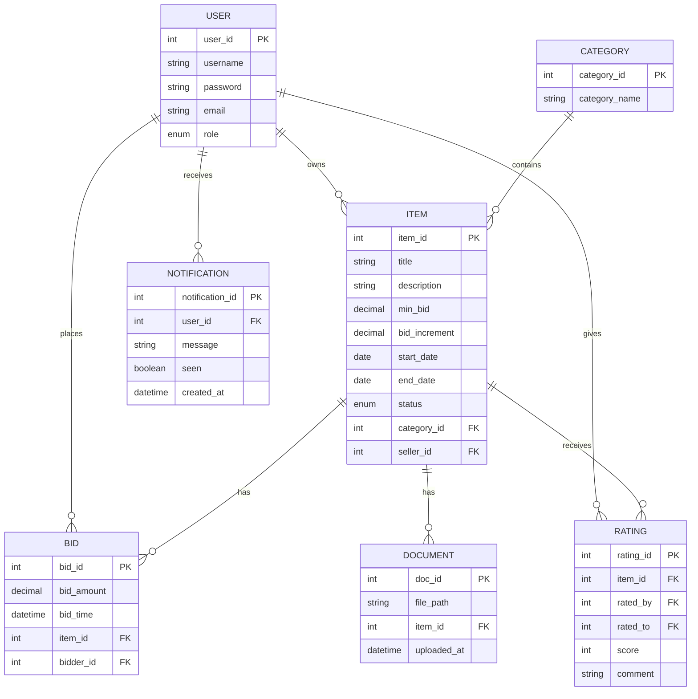

# Entity Relationship Diagram (ERD)

---

## Explain the relationship

| Relationship                        | Description                                                         |
|-------------------------------------|---------------------------------------------------------------------|
| `USER` – `ITEM` (1:N)               | Each user can list multiple items for sale                          |
| `USER` – `BID` (1:N)                | A user can place multiple bids                                      |
| `USER` – `RATING` (1:N)             | A user can give and receive multiple ratings                        |
| `ITEM` – `BID` (1:N)                | Each item can have multiple bids                                    |   
| `ITEM` – `DOCUMENT` (1:N)           | Each item can have multiple associated documents                    |
| `CATEGORY` – `ITEM` (1:N)           | Each category contains multiple items                               |
| `ITEM` – `RATING` (1:N)             | Each item can receive multiple ratings from buyers                  |

---
